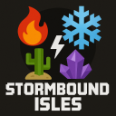

# Stormbound Isles

**Stormbound Isles** ist ein Minecraft-Projekt auf Basis von Fabric für Version 1.21.1.  
Fünf Teams treten auf fünf einzigartigen, elementar inspirierten Inseln gegeneinander an, bauen, kämpfen und überleben – während zufällige Katastrophen das Spielgeschehen beeinflussen.

Ziel ist es, die eigene Insel zu gestalten, als Team zu überleben und am Ende sowohl durch Kreativität als auch durch strategischen Kampf zu punkten.

## Features

- 5 Elementar-Inseln: Vulkan, Eis/Schnee, Wüste, Pilz, Kristall/Magie
- Katastrophen, die zufällig oder durch Events ausgelöst werden und das Gameplay beeinflussen
- Team-Passivboni abhängig von Insel und Position
- Bewertungsphase: Punkte für Bauwerke, Überleben und Kreativität – inkl. Jury-System
- PvP-Phase nach Ablauf der „Schutzwoche“ – dann sind Überfälle und Kämpfe möglich
- Modpack basierend auf Fabric (u.a. Simple Voice Chat, Sodium, Create, Iris, ...)
  

  

